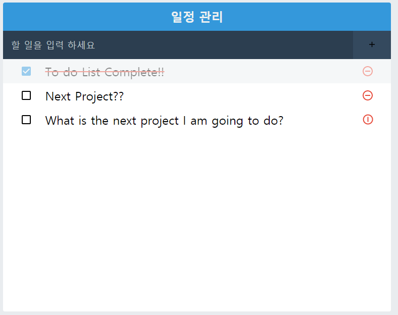

# Make TO-Do-APP using REACT

## 사용된 라이브러리

.sass or .scss 를 css로 변환

```
yarn add node-sass
```

조건부 스타일링을 위해 사용

```
yarn add classnames
```

react에서 다양한 아이콘을 사용하기 위해

```
yarn add react-icons
```

styled-components

```
yarn add styled-components
```

## 완성!!


